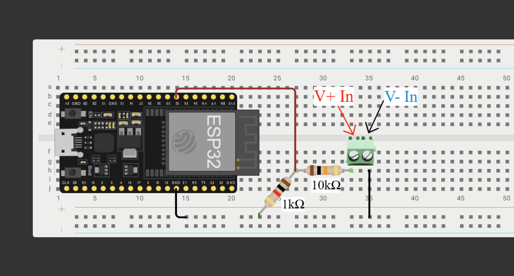
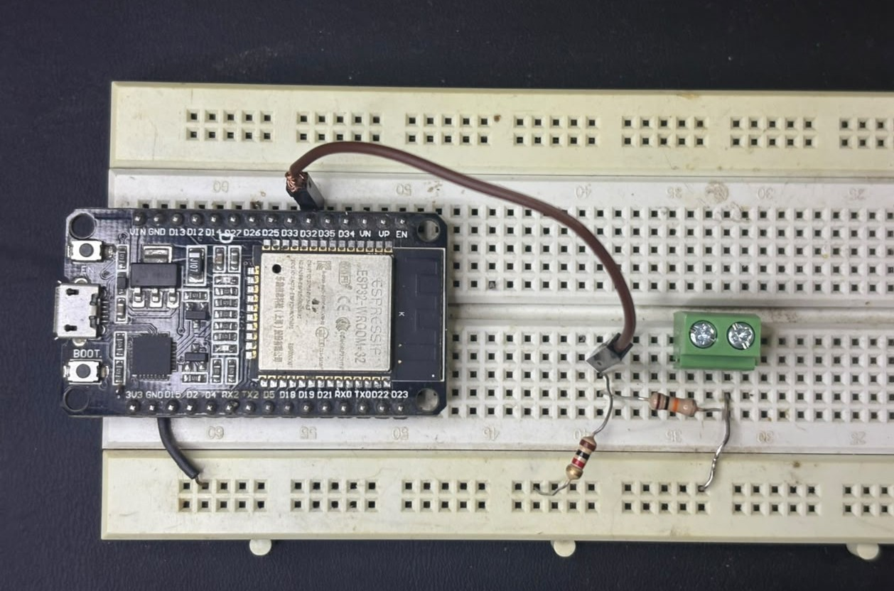

# ESP32 Wireless Oscilloscope

This project is a wireless oscilloscope built using ESP32. It can read analog signals and send them over Wi-Fi to a web page or app for real-time viewing. Users can adjust like sample rate. The system helps to measure and analyze electrical signals without using a wired connection.

**Not a full oscilloscope replacement**, just a hobby project for measuring and analyzing basic electrical signals. The intent was to make it usable on any device like Android, iOS, or desktop.

---

## How It Works

The ESP32 Wireless Oscilloscope works on a simple principle::

1. **Signal Acquisition**: The ESP32's built-in ADC (Analog-to-Digital Converter) continuously samples analog signals at user-set sample rate.
2. **Data Processing**: Sampled data is processed adjusting  voltage divider.
3. **Wireless Transmission**: The data is sent over Wi-Fi using a socket connection to a connected web interface or application in real-time.
4. **User Interaction**: Users can adjust critical parameters including:
   - **Sample Rate**: Control how frequently signals are sampled
   - **Sample per message**: Select appropriate data transfer frequency for adjusting throughput.
   - **Switch Voltage Range(future)**: Set voltage range (0-3.3V, 0-36V).
5. **Visualization**: The received data is rendered as a live waveform display on your browser or app

### Block Diagram

*System architecture showing signal flow from sensor input through ESP32 to wireless transmission and visualization*

### Breadboard Setup

---
## Components & Specifications

| Component | Details |
|-----------|---------|
| Microcontroller | ESP32 (12-bit ADC) |
| Connectivity | Wi-Fi 802.11 b/g/n |
| ADC Resolution | 12-bit (0-4095) |
| Analog Input Pins | GPIO32 |
| Analog Input Voltage | 0-36V |
| Max Sample Rate | 40 KHz (Stable) |

---

## Getting Started

1. **Assemble the Circuit**: Follow the breadboard diagram above
2. **Program the ESP32**: Upload the firmware with Wi-Fi credentials
3. **Fetch ESP32 IP**: Connect ESP32 to power supply and read ESP32 IP from serial monitor.
4. **Connect**: Connect to same Wi-Fi network. Open the web interface and connect to ESP32 via Wi-Fi
5. **Analyze**: Start capturing and analyzing signals

---

## TODO

1. Switch for voltage range (0-3.3v, 0-36V). Add a mosfet for bypassing voltage divider.
